<div align="center">

# Doodleworks MCP

**Turn any idea (a blog post, an article, an X post) into hand-drawn "Tinku" illustrations that explain the key concepts, right inside your AI host.**

<!-- what it is -->
[](https://modelcontextprotocol.io)
[](https://modelcontextprotocol.io/extensions/apps/overview)
[](https://www.typescriptlang.org/)

[](https://pnpm.io/)

<!-- status & trust -->
[](https://www.npmjs.com/package/doodleworks-mcp)
[](https://www.npmjs.com/package/doodleworks-mcp)
[](https://packagephobia.com/result?p=doodleworks-mcp)
[](https://github.com/SalZaki/doodleworks-mcp/actions/workflows/ci.yml)
[](https://github.com/SalZaki/doodleworks-mcp/actions/workflows/codeql.yml)
[](https://scorecard.dev/viewer/?uri=github.com/SalZaki/doodleworks-mcp)
[](https://socket.dev/npm/package/doodleworks-mcp) <!-- x-release-please-version -->
[](https://github.com/SalZaki/doodleworks-mcp/actions/workflows/release.yml)
[](LICENSE)
[](CODE_OF_CONDUCT.md)
[](CONTRIBUTING.md)
[](https://www.conventionalcommits.org)
[](https://github.com/SalZaki/doodleworks-mcp/stargazers)
[](https://github.com/SalZaki/doodleworks-mcp/commits/main)
[](https://buymeacoffee.com/salzaki)


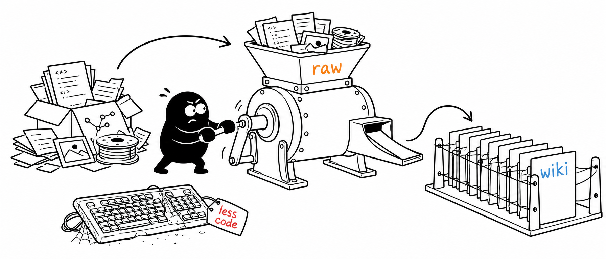

<sub>Bring your own image-API key (OpenAI or Gemini) · local stdio server · flip through, regenerate, and download, all in your host's chat.</sub>

<br/>

[**Quick start**](#-quick-start) · [Add to your host](#-add-it-to-your-ai-host) · [Using it](#-using-doodleworks) · [Parameters](#-parameters) · [The viewer](#-the-viewer) · [Examples](#-examples) · [Configuration](#-configuration) · [Build from source](#-build-from-source) · [How it works](#-how-it-works)

</div>

---

Doodleworks turns a single idea (or a whole **blog post, article, or X post**) into **clean line illustrations that explain its key concepts**, one idea per picture. It never draws the topic literally. Instead, it pulls out each concept and reinvents it as a low-tech **contraption that Tinku, the app's own character, is physically operating**: confident black lines on a pure-white background, with a few neat red/orange/blue handwritten labels.

Ask your AI host for a set of illustrations, and Doodleworks renders them and opens an **interactive viewer** right in the chat: flip through, regenerate any image you don't like, and download the PNGs.

<div align="center">
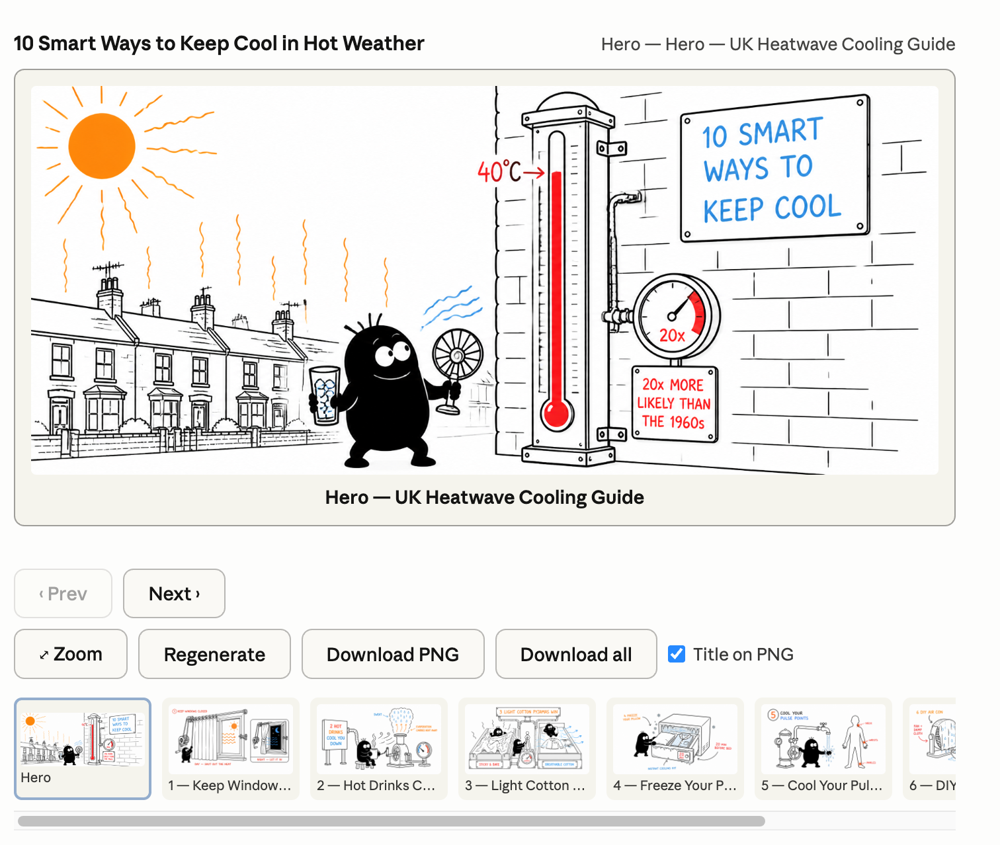
<br/><sub>The interactive viewer in Claude Desktop: browse the set, regenerate any image, and download PNGs (with an optional title burned in).</sub>
</div>

## ✨ Highlights

- 🖐️ **Hand-drawn, one idea per picture:** clean black line art on white with a few red/orange/blue labels; never a literal chart or diagram.
- 🧩 **Concepts, not clip art:** each key idea becomes a low-tech contraption that **Tinku**, the app's recurring character, physically operates.
- 🖼️ **Interactive viewer in your chat:** browse, zoom, regenerate any single image, and download PNGs, inline in supported hosts.
- 🔑 **Bring your own key:** OpenAI *or* Gemini. The key stays **server-side** and is never sent to the viewer or the iframe.
- ⚡ **Zero infrastructure:** a local stdio server you launch with one `npx` line. No clone, no build, no database.

## 🚀 Quick start

No clone and no build required: `npx` fetches the published [`doodleworks-mcp`](https://www.npmjs.com/package/doodleworks-mcp) package from npm and runs it. You'll need an image-API key to **render** (none is needed just to install).

**1. Get an image key.** Use **one** of:

- `OPENAI_API_KEY`: OpenAI GPT Image *(the default provider)*
- `GEMINI_API_KEY` *(or `GOOGLE_API_KEY`)*: Gemini 3 Pro Image ("Nano Banana Pro")

*New here? Start with `OPENAI_API_KEY`: it's the default, and every example below was generated with it. Set just one; you don't need both.*

**2. Add it to your AI host.** Drop this into your host's MCP config (Claude Desktop's `claude_desktop_config.json` shown; see [Add it to your AI host](#-add-it-to-your-ai-host) for every other host):

```json
{
  "mcpServers": {
    "doodleworks-mcp": {
      "command": "npx",
      "args": ["-y", "doodleworks-mcp"],
      "env": { "OPENAI_API_KEY": "sk-..." }
    }
  }
}
```

**3. Ask in plain language.** Restart the host, then say:

> Use **doodleworks** to create a set of 6 illustrations explaining **how a heat pump heats your home**, for homeowners, one idea per image.

> [!TIP]
> The model writes each illustration's prompt for you. You just describe the topic. In a graphical host the **viewer opens** with the gallery; in a terminal host you'll get tool output only (a text summary, not the rendered images).

## 🔌 Add it to your AI host

Doodleworks is an **MCP App**: it exposes tools *and* an interactive UI. Every host below can run the tools, but the **inline viewer** (the whole point) only renders in hosts that support MCP Apps UI.

> [!TIP]
> **Want the inline viewer?** Use **Cursor, VS Code, Claude Desktop, or Goose**. **Claude Code** and **Windsurf** run the tools but can't show the viewer (you'll get tool output instead).

| Host | Runs the tools | Shows the viewer | Notes |
| --- | :---: | :---: | --- |
| **Cursor** (2.6+) | ✅ | ✅ | Cleanest experience |
| **VS Code** (1.109+) | ✅ | ✅ | Copilot agent mode |
| **Goose Desktop** (1.19.1+) | ✅ | ✅ | Viewer is experimental |
| **Claude Desktop** | ✅ | ✅ | Fully quit + relaunch after editing config |
| **Claude Code** | ✅ | ❌ | Terminal has no webview |
| **Windsurf** | ✅ | ❌ | Tools only |
| **MCPJam / basic-host** (dev) | ✅ | ✅ | Most reliable way to see the viewer |

> [!NOTE]
> Every config below uses the **published package** (`npx -y doodleworks-mcp`), so there's no clone and no build. Hacking on your own checkout instead? Swap the command for `npx -y tsx /ABSOLUTE/PATH/doodleworks-mcp/main.ts --stdio` (see [Build from source](#-build-from-source)). Use whichever image key you exported.

<details id="cursor">
<summary><b>Cursor:</b> full viewer (Cursor 2.6+)</summary>

Create **`.cursor/mcp.json`** in your project (or `~/.cursor/mcp.json` for all projects):

```json
{
  "mcpServers": {
    "doodleworks-mcp": {
      "command": "npx",
      "args": ["-y", "doodleworks-mcp"],
      "env": { "OPENAI_API_KEY": "${env:OPENAI_API_KEY}" }
    }
  }
}
```

Then open **Cursor Settings → Tools & Integrations**, confirm `doodleworks` is enabled, and invoke it from Agent chat. Using `${env:OPENAI_API_KEY}` keeps the key out of the file (set it in your shell); or paste `sk-...` directly. The inline viewer requires **Cursor 2.6+**; older versions run the tools but won't render it.

</details>

<details id="vs-code">
<summary><b>VS Code:</b> full viewer (VS Code 1.109+, GitHub Copilot agent mode)</summary>

VS Code uses a `servers` key (not `mcpServers`) and can prompt for the key securely. Create **`.vscode/mcp.json`**:

```json
{
  "inputs": [
    { "type": "promptString", "id": "openai-api-key", "description": "OpenAI API key", "password": true }
  ],
  "servers": {
    "doodleworks-mcp": {
      "type": "stdio",
      "command": "npx",
      "args": ["-y", "doodleworks-mcp"],
      "env": { "OPENAI_API_KEY": "${input:openai-api-key}" }
    }
  }
}
```

Click **Start** above the server entry (or run `MCP: List Servers`), enter the key when prompted, then open **Copilot Chat → Agent mode** and invoke the tool. The viewer renders inline. Requires **VS Code 1.109+** (MCP Apps is in preview).

</details>

<details id="goose-desktop">
<summary><b>Goose Desktop:</b> full viewer (Goose Desktop 1.19.1+, experimental)</summary>

Goose uses YAML. Edit **`~/.config/goose/config.yaml`** (Windows: `%APPDATA%\Block\goose\config\config.yaml`):

```yaml
extensions:
  doodleworks-mcp:
    type: stdio
    name: doodleworks-mcp
    enabled: true
    cmd: npx
    args: ["-y", "doodleworks-mcp"]
    envs:
      OPENAI_API_KEY: "sk-..."
    timeout: 300
```

Or use the UI: **Sidebar → Extensions → Add custom extension** (Type: *Standard IO*; paste `npx -y doodleworks-mcp`; add the key). **Restart Goose** after adding. The viewer is **Desktop-only** and MCP Apps support is experimental.

</details>

<details id="claude-desktop">
<summary><b>Claude Desktop:</b> full viewer</summary>

Open **Settings → Developer → Edit Config** (or edit `~/Library/Application Support/Claude/claude_desktop_config.json` on macOS, `%APPDATA%\Claude\claude_desktop_config.json` on Windows):

```json
{
  "mcpServers": {
    "doodleworks-mcp": {
      "command": "npx",
      "args": ["-y", "doodleworks-mcp"],
      "env": { "OPENAI_API_KEY": "sk-..." }
    }
  }
}
```

Save, then **fully quit and relaunch** Claude Desktop (Cmd+Q, not just closing the window), and the viewer renders inline in the chat. (If an older build shows only a text fallback instead of the gallery, update Claude Desktop.)

</details>

<details id="claude-code-terminal">
<summary><b>Claude Code (terminal):</b> tools only, no viewer ❌</summary>

```bash
claude mcp add --scope project --transport stdio --env OPENAI_API_KEY=sk-... \
  doodleworks -- npx -y doodleworks-mcp
```

(or commit a project `.mcp.json` with a top-level `mcpServers` block). A terminal has no webview, so the **interactive viewer does not render here**: you'll get tool output, not the gallery. Use a graphical host for the viewer.

</details>

<details id="windsurf">
<summary><b>Windsurf:</b> tools only, no viewer ❌</summary>

Edit **`~/.codeium/windsurf/mcp_config.json`** (Windows: `%USERPROFILE%\.codeium\windsurf\mcp_config.json`; create it if missing):

```json
{
  "mcpServers": {
    "doodleworks-mcp": {
      "command": "npx",
      "args": ["-y", "doodleworks-mcp"],
      "env": { "OPENAI_API_KEY": "sk-..." }
    }
  }
}
```

Hit **Refresh** in the Cascade MCP panel (or restart Windsurf). Windsurf runs the tools but does **not** render MCP Apps UI, so the viewer won't appear inline.

</details>

<details id="see-the-viewer-reliably-dev">
<summary><b>See the viewer reliably (dev inspectors)</b> ✅, needs a local checkout</summary>

The most dependable way to see the viewer is over Streamable HTTP with a dev host (from a [cloned repo](#-build-from-source)):

```bash
pnpm start    # watch-build the viewer + serve on http://localhost:3001/mcp
```

Point the **MCP Apps `basic-host`** or the **MCPJam inspector** at `http://localhost:3001/mcp`. Both render the viewer correctly and are the recommended way to develop and to verify the gallery.

</details>

## 💬 Using Doodleworks

With the server connected, just ask your host in plain language: the model calls the tools for you and writes each illustration's `prompt`; you don't have to.

**Example prompt** (paste into any connected host):

> Use **doodleworks** to create a set of 6 illustrations explaining **how a heat pump heats your home**, for homeowners, one idea per image.

**Prefer to plan first?** Invoke the bundled prompt (it surfaces in hosts that show MCP prompts as `/mcp__doodleworks-mcp__plan_illustrations`):

> Run the doodleworks **plan_illustrations** prompt for topic "how a heat pump heats your home" (audience: homeowners, count: 6), then call **create_illustrations** with the plan.

In a graphical host (Cursor, VS Code, Claude Desktop, Goose) the **viewer opens** with the gallery; in **Claude Code** (terminal) there's no viewer, so you'll get tool output only (a text summary, not the rendered images).

<details>
<summary><b>The tools &amp; prompt</b> (reference)</summary>

- **`plan_illustrations`** *(a prompt)* turns a topic into a ready-to-render set. Args: `topic` (required), `audience?`, `count?`, `spine?` (`teaching | persuasion | report | product | knowledge-card`).
- **`create_illustrations`** renders the set (1–10 illustrations, each one paid render) and opens the viewer. Each `prompt` is a contraption + Tinku's action + a `Required text only:` block; the server adds the character, the concept engine, and the house style automatically.
- **`regenerate_illustration`** re-renders one image (the viewer's Regenerate button).
- **`get_illustration`** streams each rendered image into the viewer (app-only; the model never sees it).

See [`examples/`](examples/) for ready-to-run payloads (`net-ai-stack.json`, `keep-cool-in-hot-weather.json`, `tinku-contraptions.json`). The planning docs ship as `doc://doodleworks/*` resources, so any host has them without a separate skill.

</details>

## 🎛️ Parameters

In normal use the model fills these in from your request. You don't write JSON by hand. But you can steer any of them in plain language ("make it a 21:9 hero", "use high quality", "use the `glp-00` style", "render at 2k"). Per-call values override the [environment defaults](#-configuration).

**`create_illustrations` (set-wide)**

| Parameter | Default | What it does |
| --- | --- | --- |
| `illustrations` | *(required)* | The set, in order: 1–10 entries (each is a per-illustration object, below). |
| `title` | none | A title for the set; shown in the viewer and can be burned onto downloaded PNGs. |
| `resolution` | `1k` | Size tier: `1k` or `2k` (`2k` is heavier for inline display). |
| `quality` | `DOODLEWORKS_QUALITY` env, else `low` | OpenAI image quality: `low` / `medium` / `high` / `auto`. Lower is faster and cheaper. Ignored by Gemini. |
| `styleReference` | `DOODLEWORKS_STYLE_REF` env, else none | Drawing-style reference for the whole set: a [library id](assets/style-references/), a data-URI, or a file inside `assets/style-references/` (tool-supplied paths are sandboxed there; see the note below). Calibrates *style only*, never the character or text. |

**Per illustration** (each entry inside `illustrations[]`)

| Parameter | Default | What it does |
| --- | --- | --- |
| `prompt` | *(required)* | The contraption + Tinku's action + a `Required text only:` block. The server adds the character, the concept engine, and the house style. |
| `title` | *(required)* | Short title for this illustration. |
| `aspect` | `16:9` | `16:9` for a standard panel, or `21:9` for a wider hero illustration. |
| `archetype` | none | Optional layout aid: `process` / `cycle` / `stack` / `taxonomy` / `matrix` / `timeline` / `decision` / `data-shape` / `summary`. |
| `styleReference` | the set-wide value | Overrides the set-wide reference for just this illustration (same accepted values and sandbox). |

**`plan_illustrations` (the planning prompt)**

| Parameter | Default | What it does |
| --- | --- | --- |
| `topic` | *(required)* | The topic or source to illustrate. |
| `audience` | inferred from the topic | Who it's for and what they already know. |
| `count` | model proposes 4–8 | How many illustrations, as an integer (passed as a string in the schema). |
| `spine` | inferred from the topic | Narrative spine: `teaching` / `persuasion` / `report` / `product` / `knowledge-card`. |

> [!NOTE]
> `styleReference` resolves in order: **per-illustration → set-wide → `DOODLEWORKS_STYLE_REF` env → none**. `quality` resolves **set-wide → `DOODLEWORKS_QUALITY` env → `low`**. With no style reference anywhere, Doodleworks draws from its built-in text-only style guidance. A **tool-supplied** `styleReference` is sandboxed: it must be a library id, a data-URI, or a file inside `assets/style-references/`; only the operator-set `DOODLEWORKS_STYLE_REF` env may point elsewhere on disk. The viewer's **Regenerate** button re-renders one illustration and reuses the set's resolution, quality, and style unless you change the prompt.

## 🖼️ The viewer

Once a set renders, the viewer opens in the chat. It's fully interactive:

- **Browse:** step through with prev/next or the thumbnail strip; the optional 21:9 hero leads, the 16:9 tips follow.
- **Streams as it renders:** each illustration appears the moment it finishes, so you're never blocked waiting on the whole set.
- **Zoom:** click any illustration to enlarge it.
- **Regenerate:** image models are non-deterministic, so one click re-rolls a single illustration in place (no need to redo the whole set).
- **Download:** save one PNG or the whole set; tick **Title on PNG** to burn the title into a clean caption band below the artwork.
- **Matches your host:** it adopts the host's light/dark theme and fonts.

<div align="center">
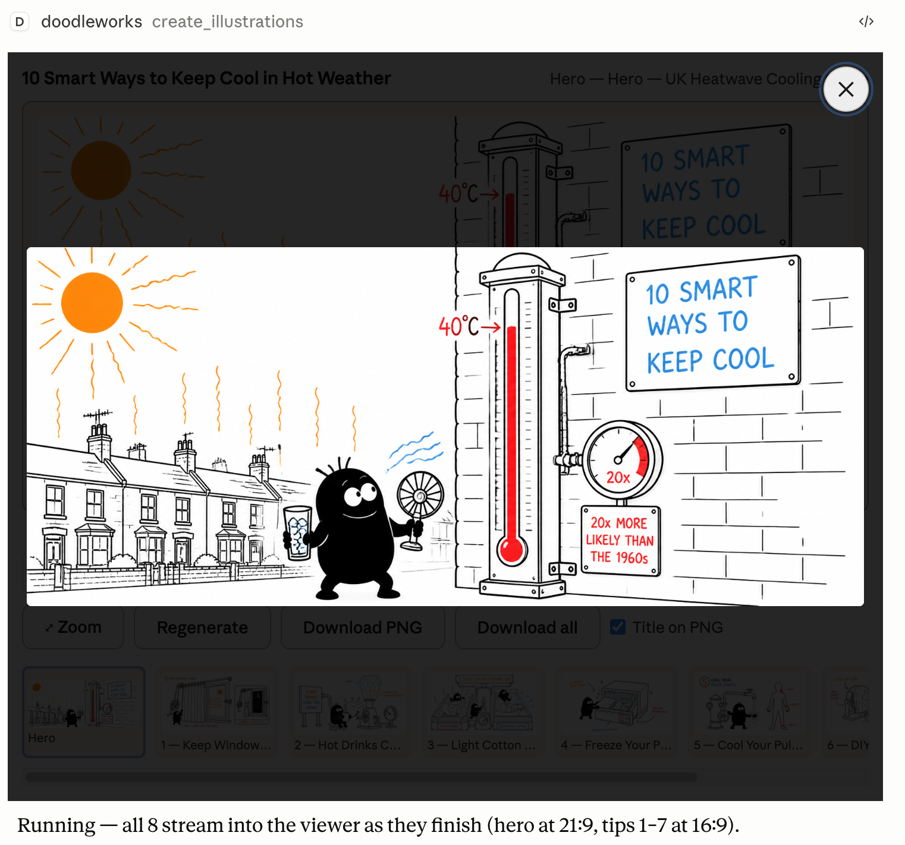
<br/><sub>Zoom view: click any illustration to enlarge it.</sub>
</div>

## 🎨 Examples

Each set below was generated by Doodleworks from a single topic: **one idea per panel**, each reinvented as a contraption Tinku operates. (Full sets live in [`assets/style-references/`](assets/style-references/).)

<details open>
<summary><b>Mounjaro / GLP‑1: a patient explainer</b></summary>

How tirzepatide (a GLP‑1/GIP medication) works, from the first injection through dosing and side effects, turning a dense medication leaflet into nine plain-English pictures. *Illustrative examples of the drawing style, not medical advice.*

<table>
  <tr>
    <td width="25%">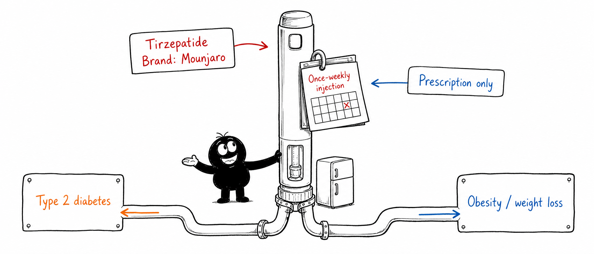<br/><sub><b>At a glance:</b> a once-weekly injection for type‑2 diabetes and weight loss.</sub></td>
    <td width="25%">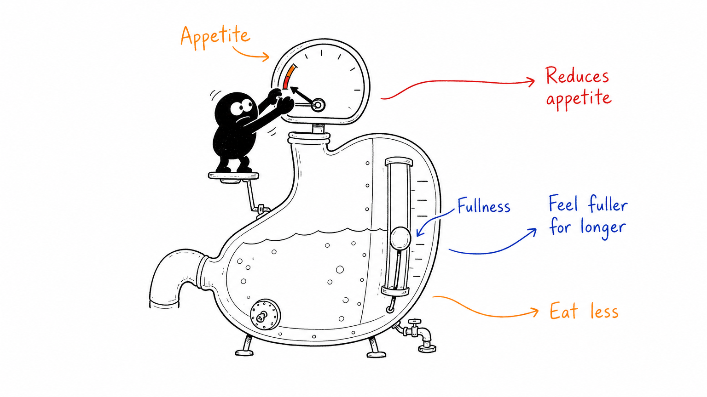<br/><sub><b>Weight loss:</b> turns appetite down so you feel fuller and eat less.</sub></td>
    <td width="25%">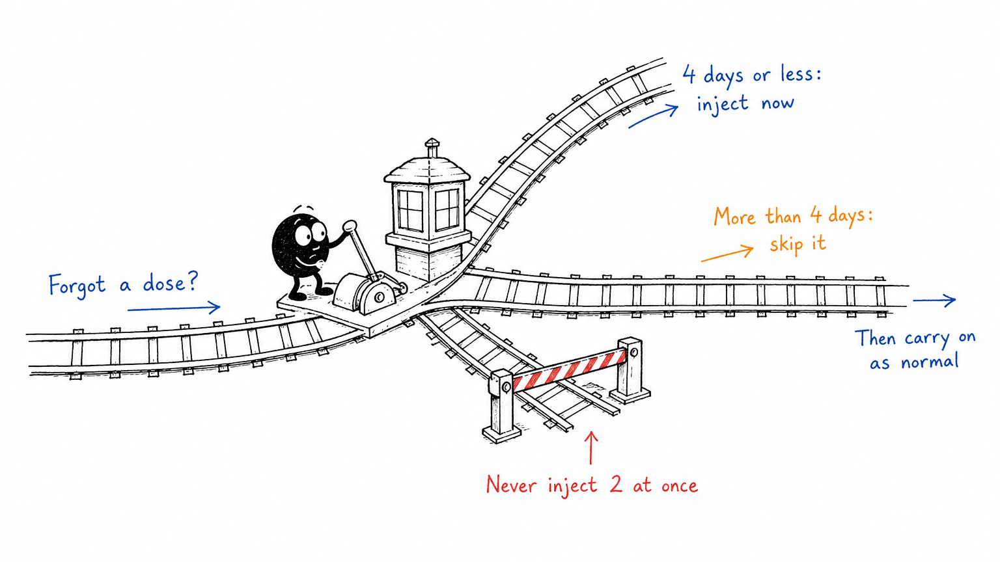<br/><sub><b>Missed a dose:</b> a track switch: ≤4 days, inject now; more, skip it.</sub></td>
    <td width="25%">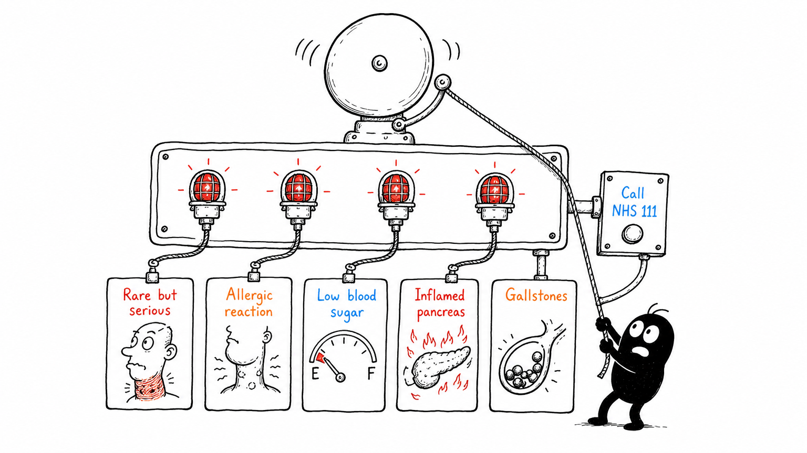<br/><sub><b>Serious signs:</b> the alarms that mean call for help.</sub></td>
  </tr>
</table>

</details>

<details>
<summary><b>Nicotine replacement therapy</b></summary>

Why nicotine isn't the harmful part, the forms NRT comes in, and how it keeps cravings steady.

<table>
  <tr>
    <td width="33%">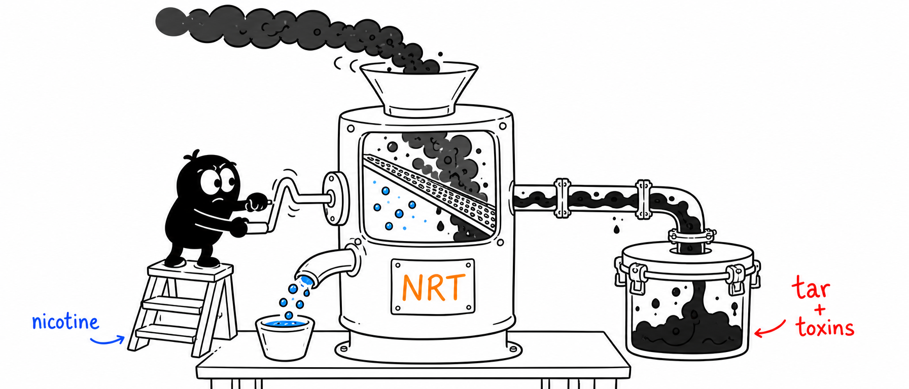<br/><sub><b>The myth vs the harm:</b> nicotine isn't the poison; tar and toxins are.</sub></td>
    <td width="33%">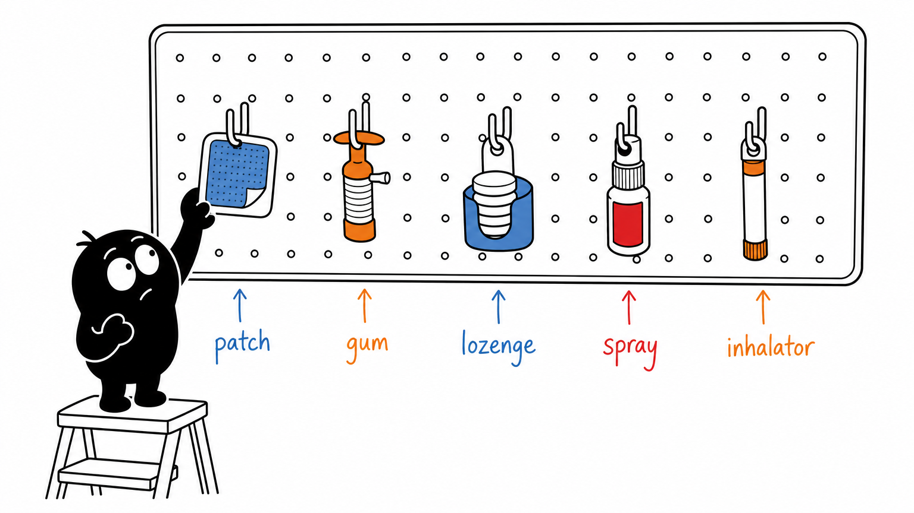<br/><sub><b>The forms:</b> patch, gum, lozenge, spray, inhalator.</sub></td>
    <td width="33%">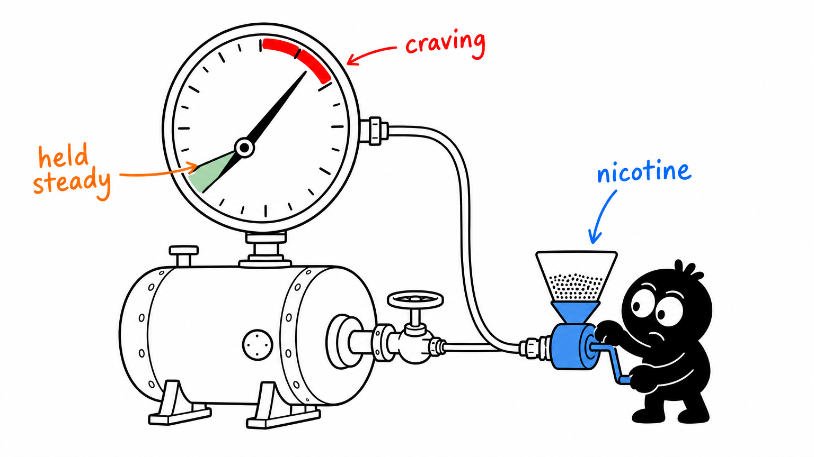<br/><sub><b>Holds cravings down:</b> keeps the gauge steady.</sub></td>
  </tr>
</table>

</details>

<details>
<summary><b>A self‑tending knowledge wiki</b></summary>

Messy sources milled into a linked wiki the model curates: question-and-answer without heavy RAG.

<table>
  <tr>
    <td width="33%"><br/><sub><b>Less code, more knowledge:</b> raw sources milled into a tidy wiki.</sub></td>
    <td width="33%">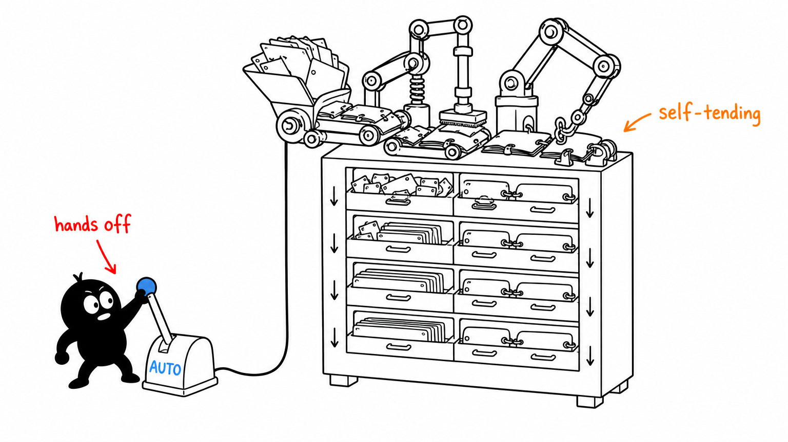<br/><sub><b>Self-tending:</b> the model curates it, hands-off.</sub></td>
    <td width="33%">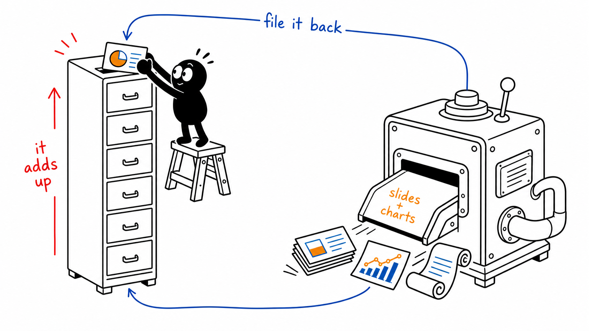<br/><sub><b>It compounds:</b> outputs accumulate over time.</sub></td>
  </tr>
</table>

</details>

<details>
<summary><b>The .NET AI stack</b></summary>

The .NET AI libraries explained: the painful early days, one foundation behind many interfaces, and agents that call tools.

<table>
  <tr>
    <td width="33%">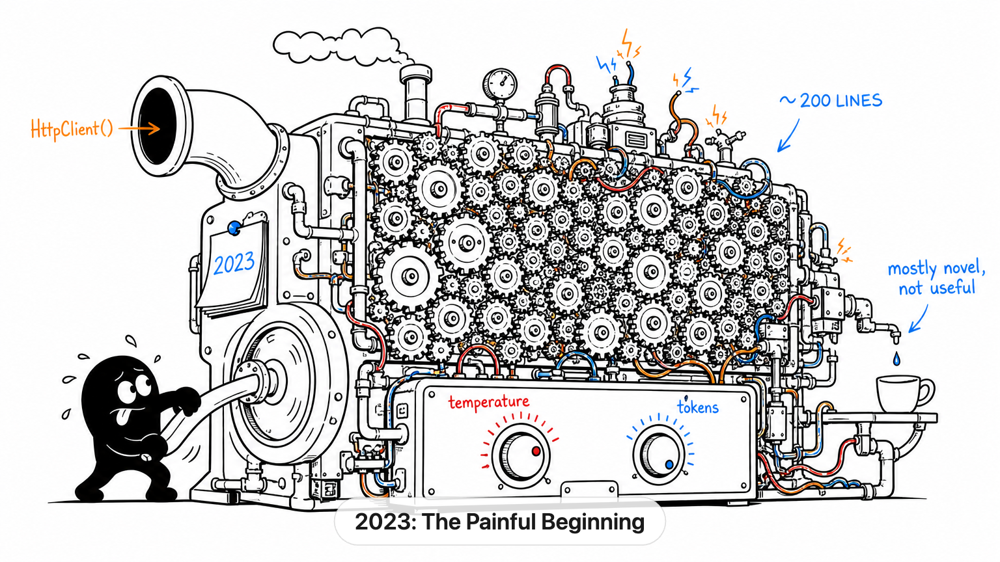<br/><sub><b>The painful beginning:</b> hand-rolled, brittle, ~200 lines.</sub></td>
    <td width="33%">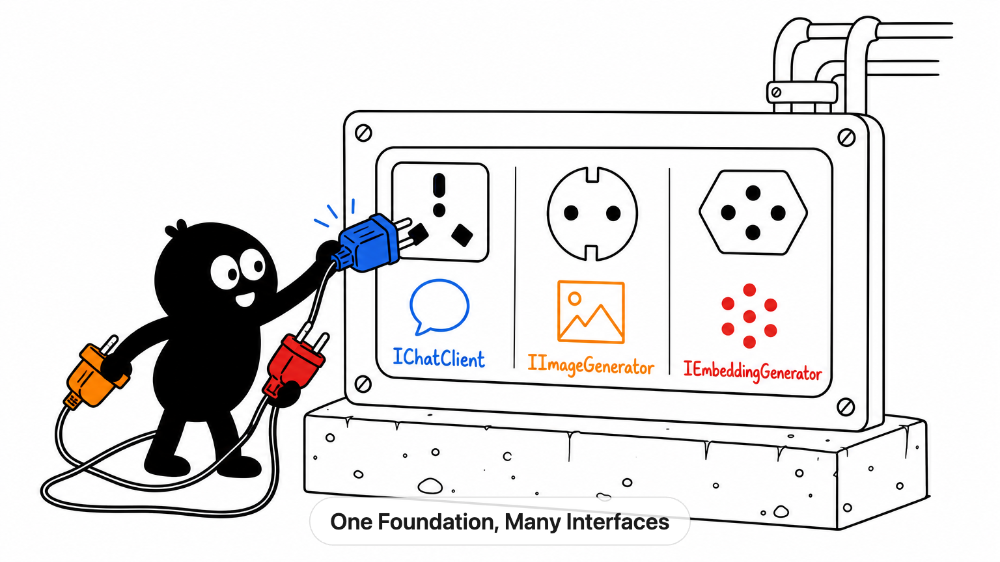<br/><sub><b>One foundation:</b> many interfaces from a single socket panel.</sub></td>
    <td width="33%">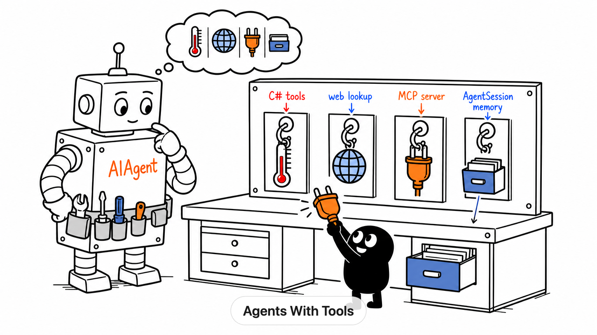<br/><sub><b>Agents with tools:</b> a robot picks tools off a pegboard.</sub></td>
  </tr>
</table>

</details>

## ⚙️ Configuration

All configuration is via environment variables (set them in your host's `env` block). Only an image key is required.

| Variable | Required | Default | What it does |
| --- | :---: | --- | --- |
| `OPENAI_API_KEY` | one key | none | OpenAI GPT Image (default provider) |
| `GEMINI_API_KEY` / `GOOGLE_API_KEY` | one key | none | Gemini 3 Pro Image ("Nano Banana Pro") |
| `DOODLEWORKS_STYLE_REF` | no | none | Default style-reference id/path ([library](assets/style-references/)) |
| `DOODLEWORKS_QUALITY` | no | `low` | `low \| medium \| high \| auto` (raise for more texture) |
| `DOODLEWORKS_CONCURRENCY` | no | `3` | Illustrations rendered in parallel (safe for OpenAI tier‑1) |
| `DOODLEWORKS_REQUEST_TIMEOUT_MS` | no | `120000` | Per-image request timeout (ms); a stalled render fails fast instead of pinning a slot |
| `PORT` | no | `3001` | Port for the dev Streamable HTTP server |

> [!IMPORTANT]
> Your image key is read from the **server's environment and used server-side only**: never placed in a tool result, sent to the viewer, or exposed to the iframe. Keep it in your host's `env` block or your shell, not in a committed file. (`.env` is gitignored and is **not** auto-loaded; the server reads `process.env` directly.)

## 🛠️ Build from source

For contributing, hacking on Tinku, or running the dev viewer inspectors. You need **Node.js 22+** and **pnpm**. No API key is needed to build or test, only to render.

```bash
git clone https://github.com/SalZaki/doodleworks-mcp.git
cd doodleworks-mcp
pnpm install
pnpm build      # type-checks + bundles the viewer into dist/mcp-app.html
pnpm test       # offline test suite (~1s, no API calls)
```

To point a host at your checkout instead of the published package, replace the host config's command with:

```json
"command": "npx",
"args": ["-y", "tsx", "/ABSOLUTE/PATH/doodleworks-mcp/main.ts", "--stdio"]
```

Replace `/ABSOLUTE/PATH/doodleworks-mcp` with your clone's real path (`pwd` in the repo; on Windows use `C:\\path\\to\\doodleworks-mcp` with doubled backslashes).

> [!WARNING]
> Always run `pnpm build` before pointing a host at a local checkout. The host serves the prebuilt viewer (`dist/mcp-app.html`); a missing or stale bundle is the **#1 cause** of the viewer not showing up. For live iteration use `pnpm start` (watch-build + restart on edits).

See [CONTRIBUTING.md](CONTRIBUTING.md) for the test-first workflow, the Tinku sync gate, and branch/commit conventions.

## 🧩 How it works

<details>
<summary><b>Architecture:</b> the no-bytes-in-the-result design</summary>

An MCP App is a tool plus a UI resource. `create_illustrations` renders the illustrations and is registered with `_meta.ui.resourceUri`, so the host fetches the `ui://doodleworks-mcp/viewer.html` resource and renders it in a sandboxed iframe.

To keep your context clean and stay under the MCP per-result size cap, **no image bytes go in the tool result**: it carries only a `setId` plus illustration metadata. The server keeps freshly-rendered images in a small in-process LRU (last 8 sets), and the viewer pulls each image via a separate `get_illustration` call (one image per result). Renders happen in the background, so the call returns immediately and images stream into the viewer as they finish.

```
host LLM ── create_illustrations(illustrations[]) ─▶ server: render × N  (OpenAI / Gemini, your key)
   model sees: 1-line summary ◀── content (no bytes)         cache.set(setId, …)
   viewer sees: { setId, metadata } ◀── _meta["doodleworks/set"]
   viewer ── get_illustration({ setId, index }) ─▶ one image per result ─▶ iframe gallery
```

Because images live only in the in-process cache, they survive only as long as the server process (and the last 8 sets). That's the deliberate trade-off of this **personal tier**: zero infrastructure, no key-handling liability. To persist images or share them across users, that's the signal to move to a hosted tier.

</details>

<details>
<summary><b>Style references &amp; customizing Tinku</b></summary>

`assets/style-references/` is an extensible library: drop in a `.png/.jpg/.webp/.gif` and it's available immediately as a style reference (it calibrates *drawing style* only, never the character or text). Set one per-illustration, set-wide, or via `DOODLEWORKS_STYLE_REF`. See the [library README](assets/style-references/README.md) for the full gallery and how it works.

**Tinku** is the app's own character, defined once in `engine.ts` as `TINKU_CHARACTER`: a small solid-black egg-blob worker with two big eyes and mitten-hands, always operating the contraption. Edit that constant to restyle him (and keep `references/visual-dna.md` in sync via `pnpm run check:tinku`, enforced by the build).

</details>

## ✅ Status &amp; validation

Personal-tier and experimental, but it works: `pnpm install && pnpm build && pnpm test` runs green (offline test suite, no API calls), and CI re-runs build + test on Node 22 and 24 with pnpm 10.34.3. The live `openai` / `@google/genai` image calls aren't covered by tests; do a live render once after any SDK upgrade.

## 🤝 Contributing &amp; security

- [CONTRIBUTING.md](CONTRIBUTING.md): dev setup, the test-first workflow, and the Tinku sync gate.
- [SECURITY.md](SECURITY.md): report a vulnerability privately.
- [CHANGELOG.md](CHANGELOG.md): notable changes.

## ☕ Support this project

Doodleworks is free and maintained in my spare time. If it's useful to you, a coffee helps cover image-API and hosting costs and keeps the updates coming. Thank you.

<p align="center">
  <a href="https://buymeacoffee.com/salzaki">
    
  </a>
</p>

## 📄 License

[MIT](LICENSE) © Salahuddin Zaki. The bundled style-reference images are the project's own artwork; an MIT *code* license doesn't cover artwork. See the [library README](assets/style-references/README.md).
